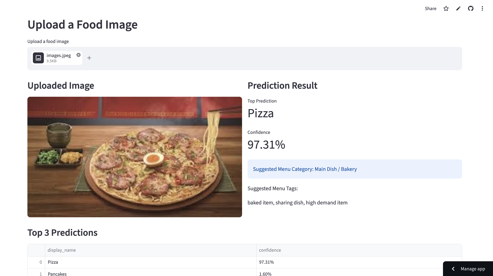
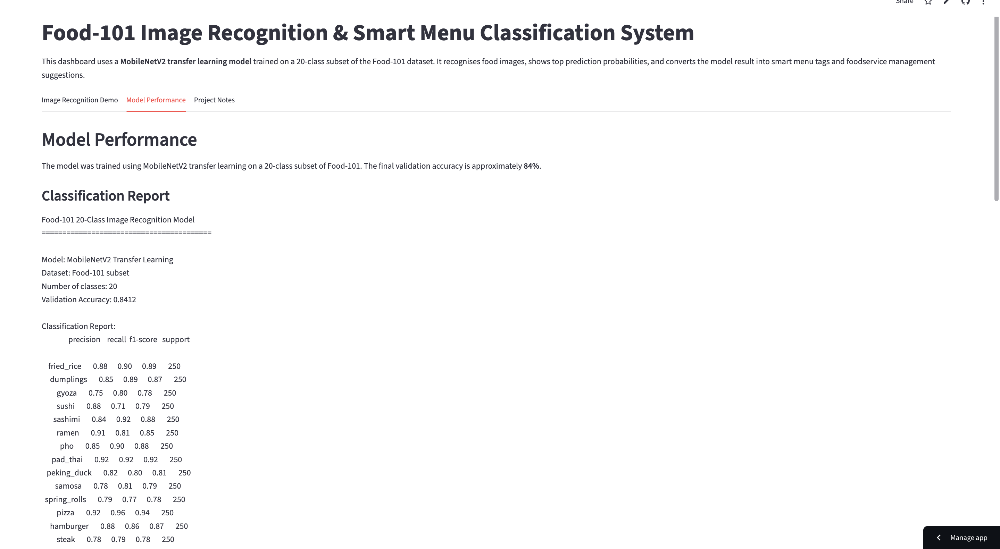

# Food-101 Image Recognition & Smart Menu Classification System

## Quick Links

- **Live Demo:** [https://food-image-recognition-menu-classification-xbqvu4ddt5cketdekzn.streamlit.app/](https://food-image-recognition-menu-classification-xbqvu4ddt5cketdekzn.streamlit.app/)
- **Main App:** [app/streamlit_app.py](app/streamlit_app.py)
- **Trained Model:** [models/food101_mobilenetv2_classifier.keras](models/food101_mobilenetv2_classifier.keras)
- **Class Names:** [models/class_names.json](models/class_names.json)
- **Model Metrics:** [reports/model_metrics.txt](reports/model_metrics.txt)
- **Confusion Matrix:** [reports/confusion_matrix.png](reports/confusion_matrix.png)

---

---

## Dashboard Preview

### Image Recognition Demo

### Model Performance

---

## 1. Project Overview

This project is a deep learning-based food image recognition system using MobileNetV2 transfer learning and a 20-class subset of the Food-101 dataset.

The system allows users to upload a food image, predicts the food category, displays the top prediction probabilities, and converts the prediction result into smart menu tags and foodservice operational suggestions.

## 2. Model Performance

The model achieved approximately **84% validation accuracy** on a 20-class Food-101 subset.

- Model: MobileNetV2 Transfer Learning
- Dataset: Food-101 subset
- Number of classes: 20
- Image size: 224 × 224
- Validation accuracy: 84%

## 3. Selected Food Classes

The model recognises the following 20 food categories:

- fried_rice
- dumplings
- gyoza
- sushi
- sashimi
- ramen
- pho
- pad_thai
- peking_duck
- samosa
- spring_rolls
- pizza
- hamburger
- steak
- fish_and_chips
- grilled_salmon
- caesar_salad
- ice_cream
- cheesecake
- pancakes

## 4. Dashboard Features

The Streamlit dashboard includes:

1. Food image upload
2. Top-3 prediction results
3. Confidence score visualisation
4. Smart menu category mapping
5. Suggested menu tags
6. Foodservice operational suggestion
7. Model performance report
8. Confusion matrix display

## 5. Tools and Technologies

- Python
- TensorFlow / Keras
- MobileNetV2
- Transfer Learning
- Food-101 Dataset
- Streamlit
- pandas
- NumPy
- Plotly
- Pillow

## 6. Operational Relevance

This project demonstrates how computer vision can support foodservice and hospitality operations, including:

- Food image recognition
- Digital menu tagging
- Menu search and filtering
- Buffet item classification
- Customer recommendation systems
- Foodservice data analytics

## 7. Limitations

The model recognises only the selected 20 Food-101 classes. It is not yet trained on Malaysian-specific dishes such as nasi lemak, roti canai, or char kway teow.

## 8. Future Improvements

Future improvements may include:

- Adding Malaysian cuisine image classes
- Fine-tuning EfficientNet or Vision Transformer models
- Adding Grad-CAM visual explanations
- Adding nutrition and allergen tags
- Integrating with a digital menu management system

## 9. Relevance to Graduate Study

This project supports my transition from Culinary Management to Artificial Intelligence and Data Science. It demonstrates my ability to apply computer vision, deep learning, and foodservice domain knowledge to a practical AI application.
